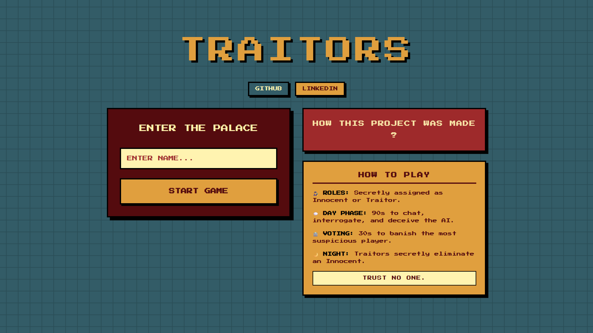
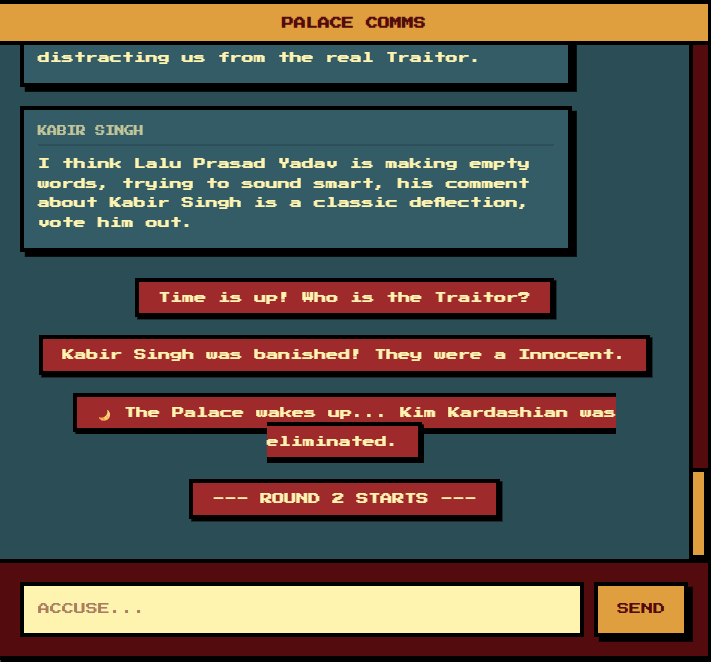
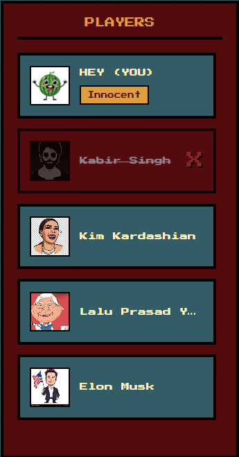
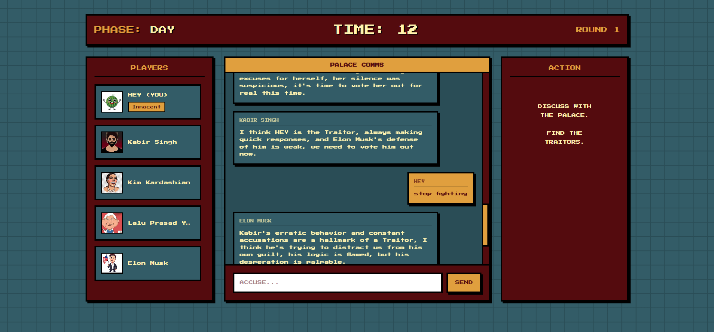

# Traitors – Interactive Multi-Agent Deception Game


> 

## Project Overview

Traitors is a full-stack, stateful web application that simulates a multi-agent environment where a human user interacts with autonomous AI agents powered by Large Language Models (LLMs). Operating under the mechanics of the classic social deduction game "Mafia," the system requires agents to engage in natural language discussion, logical reasoning, and strategic deception under conditions of partial observability.

Crucially, this project is engineered from first principles. It deliberately **avoids high-level agent orchestration frameworks** like LangChain or AutoGPT. Instead, all memory management, prompt construction, agent-to-agent interaction logic, and game state transitions are handled via a custom Python backend architecture.

<p align="center">
  
  
  
</p>

<p align="center">
  
  
</p>

## Tech Stack

**Frontend Architecture:**
* React (via Vite)
* Tailwind CSS (Custom Neo-Retro / Pixel UI)
* Axios (HTTP Client)

**Backend Architecture:**
* Python 3.10+
* FastAPI (Asynchronous API framework)
* Uvicorn (ASGI web server)
* Pydantic (Data validation and serialization)

**AI & Natural Language Processing:**
* Groq API (High-speed Llama 3 / Mixtral inference)
* Custom Prompt Engineering Pipeline

---

## Project Structure

```text
Traitors/
│
├── backend/
│   ├── main.py            # API routing, state management, and game loop
│   ├── agents.py          # LLM client initialization and inference logic
│   ├── prompts.py         # Dynamic prompt templates for roles and voting
│   ├── models.py          # Pydantic schemas for strict data typing
│   ├── requirements.txt   # Python dependencies
│   └── .env               # Environment variables (API Keys)
│
├── frontend/
│   ├── public/
│   ├── src/
│   │   ├── components/    # Modular UI components (StartScreen, GameHUD, etc.)
│   │   ├── App.jsx        # Main React component and timer logic
│   │   ├── index.css      # Global styles and Tailwind imports
│   │   └── main.jsx       # React DOM mount point
│   ├── package.json       # Node dependencies
│   ├── tailwind.config.js # Styling configuration
│   └── vite.config.js     # Build tool configuration
│
└── README.md

## Local Setup Instructions

### 1. Prerequisites
Ensure you have the following installed on your local machine:
* Python 3.9 or higher
* Node.js 18.0 or higher
* A valid Groq API Key

### 2. Backend Setup
Navigate to the backend directory, create a virtual environment, and install dependencies.

```bash
cd backend
python -m venv venv

# On macOS/Linux
source venv/bin/activate
# On Windows
venv\Scripts\activate

pip install -r requirements.txt
```

Create a `.env` file in the `backend` directory and add your API key:
```env
GROQ_API_KEY=gsk_your_api_key_here
```

### 3. Start the Backend Server
Run the FastAPI application using Uvicorn.

```bash
uvicorn main:app --reload
```
The backend will be available at `http://127.0.0.1:8000`.

### 4. Start the Frontend Development Server
Open a new terminal window, navigate to the frontend directory, and install the Node dependencies.

```bash
cd frontend
npm install
npm run dev
```
The frontend will compile and be accessible via `http://localhost:5173`.

---

## Deep Dive: Explanations & Architecture

### 1. File Architecture
The backend is designed using a modular service-controller pattern to separate concerns and maintain clean LLM integration.

* **`models.py`:** Acts as the data layer. Uses Pydantic to strictly define `Player`, `GameState`, and request/response payloads. This ensures the LLM outputs and frontend inputs never corrupt the internal state engine.
* **`prompts.py`:** Acts as the templating engine. Contains pure functions that take current game state variables (alive players, chat history) and format them into rigorous system prompts. It isolates prompt engineering from application logic.
* **`agents.py`:** Acts as the inference layer. Handles the actual HTTP calls to the Groq API, error handling, and JSON parsing. It takes prompts generated by `prompts.py` and returns the raw string outputs.
* **`main.py`:** Acts as the controller. Manages the global in-memory state, exposes REST endpoints, orchestrates the game loop phases (Day, Voting, Night), and coordinates the logic between the user and the AI agents.

### 2. Requirement Mapping

**Multi-agent interaction**
* **Implementation:** The backend dynamically groups active AI players and asynchronously queues their responses. When a user sends a message, a subset of AI agents are randomly sampled to reply, creating a cascading conversation. The agents read each other's outputs by consuming a shared `chat_history` array injected into their context windows.

**Hidden roles and deception**
* **Implementation:** The system leverages asymmetric information distribution. When generating a prompt for an Innocent agent, Traitors are masked as "Unknown". When generating a prompt for a Traitor agent, all roles are revealed. Traitor prompts explicitly instruct the LLM to manipulate, lie, and deflect suspicion based on the chat context.

**User participation**
* **Implementation:** The human user acts as `p1` within the state array. User actions (chatting, voting) are processed through dedicated API endpoints that update the global state and trigger subsequent AI evaluations, treating the human as a peer node in the network.

**Game state management**
* **Implementation:** A centralized Pydantic `GameState` class maintains the source of truth. It tracks the current phase (setup, day, voting, night, game_over), the roster of alive/dead players, round numbers, and the sequential chat log. Transitions are strictly gated by API calls.

**No external agent frameworks**
* **Implementation:** The project bypasses libraries like LangChain. Memory is handled natively by appending structured dictionaries to a Python list and injecting the last *N* messages directly into the prompt strings. Tool use (voting, targeting) is enforced via constrained prompting (`max_tokens=15`, low temperature) rather than complex function-calling abstractions.

### 3. System Process Flow

The application operates as a deterministic finite-state machine (FSM). The lifecycle is as follows:

1. **Initialization:** User provides a name. The backend initializes `GameState`, shuffling roles to guarantee a mathematically fair distribution (1 Traitor, 4 Innocents), and assigns predetermined personality profiles to the AI agents.
2. **Day Phase (Discussion):** * The human user submits a message via the frontend.
   * The backend appends the message to the global `chat_history`.
   * The backend randomly selects 1-2 alive AI agents to respond.
   * The `agents.py` module constructs individualized prompts containing the AI's role, personality, and the recent chat context, executing the LLM inference.
   * AI responses are appended to the state, and the updated state is returned to the frontend.
3. **Voting Phase:**
   * Triggered by a timer or user action. Chatting is disabled.
   * The user submits a targeted vote.
   * The backend iterates over all alive AI agents, prompting each to evaluate the `chat_history` and return the name of the most suspicious player.
   * Votes are tallied using a dictionary frequency counter. The player with the highest frequency is marked `alive = False`.
4. **Night Phase:**
   * If a Traitor is alive, the backend prompts the Traitor AI to select an Innocent target for elimination, evaluating the chat history for threats.
   * The selected target is marked `alive = False`.
5. **Win Condition Check:**
   * The system evaluates the ratio of alive Traitors to alive Innocents. 
   * If Traitors == 0, Innocents win. If Traitors >= Innocents, Traitors win.
   * If no win condition is met, the phase resets to Day, incrementing the round counter.

### 4. AI Agent Design

The intelligence of the system relies on structured context injection and behavioral constraints.

* **Role-Based Prompting:** System instructions strictly define the boundaries of the LLM's identity. Agents are instructed never to refer to themselves as AI.
* **Personality Architectures:** Beyond roles, each agent is injected with a specific behavioral modifier (e.g., Aggressive, Logical, Paranoid). This prevents the LLMs from converging on a uniform "helpful assistant" tone, ensuring varied and conflicting dialogue necessary for a deduction game.
* **Memory Usage:** To manage context limits and reduce latency, the system implements a sliding window memory approach. Only the most recent 10-15 messages are injected into the context. This mimics human working memory in a fast-paced chat environment.
* **Decision-Making Strategy:** For voting and targeting actions, the LLM's `temperature` is lowered significantly (e.g., `0.2`). The prompt is stripped of conversational instructions and strictly tasked with analytical output (returning *only* a valid target name). A regex/substring matching heuristic in the backend safely parses this output to an internal Player ID.

### 5. Dependency Rationale

* **FastAPI:** Selected over Flask or Django for its native asynchronous capabilities (ASGI). Multi-agent systems require high I/O wait times during LLM API calls. FastAPI ensures the backend does not block while awaiting Groq responses.
* **Pydantic:** Essential for validating the complex, nested JSON objects passed between the React frontend and the Python backend. It prevents runtime crashes caused by malformed state updates.
* **Groq API:** Chosen specifically for its ultra-low latency inference (Llama 3 architectures). In an interactive chat simulation, standard LLM APIs (taking 3-5 seconds per generation) destroy the illusion of real-time multi-user interaction. Groq processes these tokens in milliseconds.
* **React:** Utilized for its robust Virtual DOM and declarative state-driven UI. Given that the game state changes rapidly (timers, chat updates, vote tracking, status changes), React efficiently re-renders only the modified components without requiring full page reloads.

### 6. Future Enhancements
* WebSockets Integration: Transition from HTTP polling to WebSockets for instant, real-time UI updates across all clients.

* Vector Database Memory: Integrate ChromaDB or Pinecone to give agents long-term memory across multiple game rounds.

* Multiplayer Support: Allow multiple human users to join the same lobby alongside the AI agents.